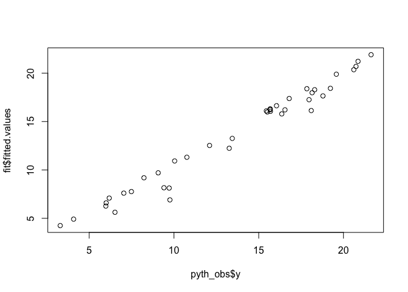
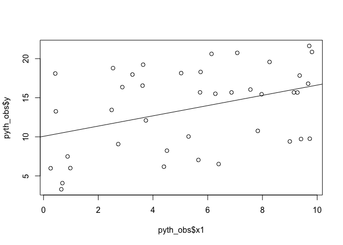
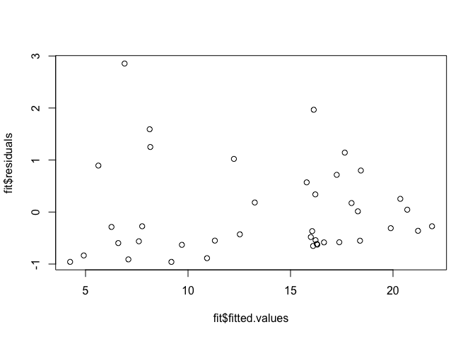
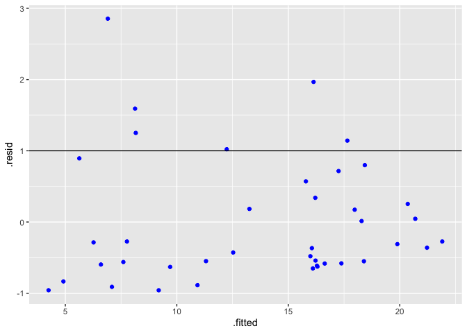
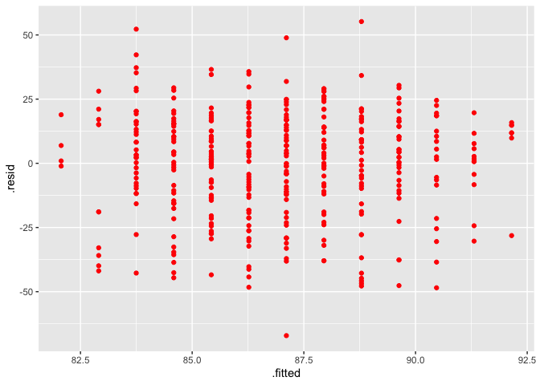
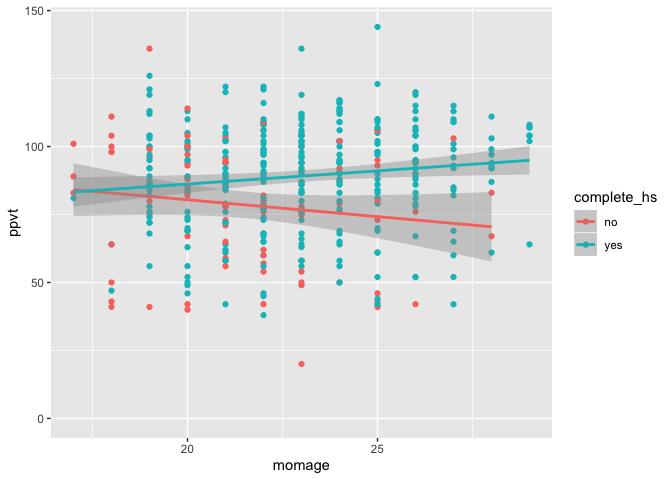
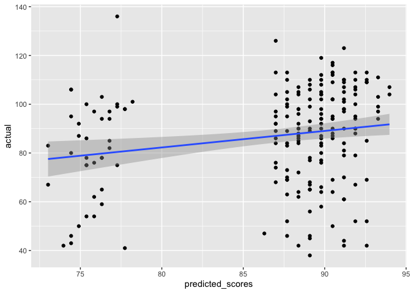

``` r
stat_sig <- function(fit){
  
  fit_frame <- data.frame(coef = coef(fit), se_coef = se.coef(fit))
  fit_frame$lower <- fit_frame$coef - 2*fit_frame$se_coef
  fit_frame$upper <- fit_frame$coef + 2*fit_frame$se_coef
  
  fit_frame <- fit_frame %>%
                mutate(stat_sig = case_when(
                       lower < 0 & upper > 0 ~ "not sig",
                       lower < 0 & upper < 0 ~ "sig",
                       lower > 0 & upper > 0 ~ "sig"
                       ))
  
  return(fit_frame)
}
```

Chapter 3 Exercises
-------------------

### 1

``` r
pyth <- read.table("exercise2.1.dat", header = T)
```

``` r
# cleaning 
pyth_obs <- pyth[!is.na(pyth$y),]
pyth_no <- pyth[is.na(pyth$y),]
```

#### A - Fit Linear Regression y ~ x1, x2

``` r
fit <- lm(y ~ x1 + x2, data = pyth_obs)
display(fit)
```

    ## lm(formula = y ~ x1 + x2, data = pyth_obs)
    ##             coef.est coef.se
    ## (Intercept) 1.32     0.39   
    ## x1          0.51     0.05   
    ## x2          0.81     0.02   
    ## ---
    ## n = 40, k = 3
    ## residual sd = 0.90, R-Squared = 0.97

-   Between groups whose x1 differed by 1 and whose x2 values are the same, on average their y differed by .51. Between groups whose x1 differed by 10 and whose x2 values are the same, on average their y differed by 8.

-   The intercept represents the predicted value for the group that had x1 and x2 = 0. This may or may not make sense to interpret given the variables.

-   The residual standard deviation is small indicating that on average observations fall within .90 of their predicted values. This indicates a fairly decent fit

``` r
plot(fit$fitted.values ~ pyth_obs$y)
```



-   The graph displays that the fitted values and actual observations are fairly close

``` r
# to obtain the residual standard deviation manually 
fit_df <- data.frame(obs = pyth_obs$y, pred = fit$fitted.values, resid = pyth_obs$y - fit$fitted.values)

# sum of residuals squared / n-k 
sum_resid <- sum(fit_df$resid^2)
sqrt(sum_resid/37)
```

    ## [1] 0.9000333

#### B - Display fit of model grpahically

``` r
plot(pyth_obs$y ~ pyth_obs$x1)
abline(lm(pyth_obs$y ~ pyth_obs$x1))
```



#### C - Residual plot, are the assumptions met

``` r
# residual plot is the residuals versus the fitted values of the model 
plot(fit$residuals ~ fit$fitted.values)
```



-   No strong patterns, assumptions do appear to be met!

#### C (Again) - Alternatively, we can also create a residual plot with broom + ggplot2

``` r
fit_augment <- augment(fit) # converts the model into df, very nice ! 
ggplot(fit_augment, aes(x= .fitted, y= .resid)) + geom_point(colour = 'blue') + geom_hline(yintercept = 1)
```



#### D - Make predictions remaining 20 data points - are you confident with these predictions?

``` r
predict.lm(fit, pyth_no)
```

    ##        41        42        43        44        45        46        47 
    ## 14.812484 19.142865  5.916816 10.530475 19.012485 13.398863  4.829144 
    ##        48        49        50        51        52        53        54 
    ##  9.145767  5.892489 12.338639 18.908561 16.064649  8.963122 14.972786 
    ##        55        56        57        58        59        60 
    ##  5.859744  7.374900  4.535267 15.133280  9.100899 16.084900

-   We can be fairly confident with these predictions, the model did fit the data fairly well.

### 3

#### A- Generating Data (Is Slope Coefficient Statistically Significant ?)

``` r
var1 <- rnorm(1000, 0, 1)
var2 <- rnorm(1000, 0, 1)

fit3 <- lm(var1 ~ var2)

display(fit3)
```

    ## lm(formula = var1 ~ var2)
    ##             coef.est coef.se
    ## (Intercept) -0.03     0.03  
    ## var2         0.00     0.03  
    ## ---
    ## n = 1000, k = 2
    ## residual sd = 1.02, R-Squared = 0.00

``` r
# use sqrt(diag(vcov(fit3))) to get SE

paste("[", as.character(coef(fit3)[2] - 2 * sqrt(diag(vcov(fit3)))[2]), ", ", as.character(coef(fit3)[2] + 2 *
                                                                                             sqrt(diag(vcov(fit3)))[2]), "]",
      sep = "")
```

    ## [1] "[-0.0656419704609558, 0.0642466998682093]"

-   The CI constructed confirms that the **slope coefficient estimate** is **not** statistically significant because 0 falls within the CI, therefore the estimate is not more than 2 SE away from zero.

#### B - Run Simulation (Count how many times the Slope Coefficient is Statistically Significant)

``` r
set.seed(717)
z.scores <- rep(NA, 100)

for(i in 1:100){
  
  var1 <- rnorm(1000, 0, 1)
  var2 <- rnorm(1000, 0, 1)
  
  fit <- lm(var1 ~ var2)
  
  z.scores[i] <- coef(fit)[2] / se.coef(fit)[2] 
  
}

abs_z.scores <- abs(z.scores)
length(abs_z.scores[abs_z.scores > 2])
```

    ## [1] 7

-   After simulating the regression 100 times, the **slope coefficient** was only statisically significant 7 times. This is about 7% of the time.

### 4

#### A - Fit regression of child test scores on mother's age, display the data + fitted model, check assumptions, and interpret the slope coefficient. When do you recommend mothers should give birth? What are you assuming in making these recommendations?

##### Fit regression + display model

``` r
fit_iq <- lm(ppvt ~ momage, data = iq.data)
display(fit_iq)
```

    ## lm(formula = ppvt ~ momage, data = iq.data)
    ##             coef.est coef.se
    ## (Intercept) 67.78     8.69  
    ## momage       0.84     0.38  
    ## ---
    ## n = 400, k = 2
    ## residual sd = 20.34, R-Squared = 0.01

##### Assumptions

``` r
# residual plot 
fit_iq.df <- augment(fit_iq)
ggplot(fit_iq.df, aes(x = .fitted, y = .resid)) +
  geom_point(colour = "red")
```



-   The residual plot looks abnormal -- an interaction might be needed for this regression. Homoscedasticity appears to hold.
-   Likewise, the residual sd is pretty high indicating that on average observations fall within 20.34 of their predicted values.

``` r
## testing homoscedasticity with breusch pagan test 
library(lmtest)
bptest(ppvt ~ momage ,data = iq.data) 
```

    ## 
    ##  studentized Breusch-Pagan test
    ## 
    ## data:  ppvt ~ momage
    ## BP = 0.40637, df = 1, p-value = 0.5238

-   Breusch-Pagan test shows that we fall to reject the null hypothesis (homoscedasticity) because the p-values is not less than .05.

##### Interpretation of slope coefficient / Recommendation

-   For groups of children whose mother's ages when giving birth differed by 1 year, on average their difference in test scores was .84. Likewise, for groups of children whose mother's ages when giving birth differed by 10 years, on average their difference in test scores was 8 points. Based of this model, I would recommend that mothers give birth later. With this recommendation, I am assuming that the model is goood fit.

#### B - Repeat this regression that further includes mother's education, interpreting both slope coefficients in this model. Have your conclusions about the timing of birth changed?

``` r
fit_iq2 <- lm(ppvt ~ momage + educ_cat, data = iq.data)
display(fit_iq2)
```

    ## lm(formula = ppvt ~ momage + educ_cat, data = iq.data)
    ##                 coef.est coef.se
    ## (Intercept)     72.24     8.87  
    ## momage           0.29     0.40  
    ## educ_caths       9.94     2.60  
    ## educ_catcollege  8.84     3.22  
    ## educ_catgrad    17.68     4.71  
    ## ---
    ## n = 400, k = 5
    ## residual sd = 19.92, R-Squared = 0.06

##### Interpretations / Recommendation

-   The intercept represents the average score for the group of children whose mothers gave birth at age 0 and did not complete high school. In this case, the intercept does not make sense

-   The coefficient on momage represents - For those groups of children whose moms have the same education level, but their age of giving birth differs by 1 year, the average difference in their test scores is .29.

-   The coefficient on hs represents - For those groups of children whose moms were the same age giving birth, but their education levels differ from hs to nonhs, the average difference in their test scores is 9.94.

-   The coefficient on college represents - For those groups of children whose moms were the same age giving birth, but their education levels differ from nohs to college degree, the average difference in their test scores is 8.84.

-   The coefficient on grad represents - For those groups of children whose moms were the same age giving birth, but their education levels differ from nohs to graduate degree, the average difference in their test scores is 17.68.

-   It does seem that mom age at giving birth is not as important in determining test scores, but rather a mother's eduction level.

#### C - Create an indicator variable reflecting whether the mother has completed hs or not. Consider interactions between hs completion and mother's age at giving birth.

``` r
iq.data <- iq.data %>%
  mutate(complete_hs = ifelse(educ_cat == 'no hs', "no", "yes"))

fit_iq3 <- lm(ppvt ~ momage + complete_hs + momage:complete_hs, data = iq.data)
display(fit_iq3)
```

    ## lm(formula = ppvt ~ momage + complete_hs + momage:complete_hs, 
    ##     data = iq.data)
    ##                       coef.est coef.se
    ## (Intercept)           105.22    17.65 
    ## momage                 -1.24     0.81 
    ## complete_hsyes        -38.41    20.28 
    ## momage:complete_hsyes   2.21     0.92 
    ## ---
    ## n = 400, k = 4
    ## residual sd = 19.85, R-Squared = 0.06

``` r
#stat_sig(fit_iq3)
```

-   In this case, the intercept represents the average score for children of mom's that did not complete highschool and who gave birth at age 0. Does not make sense in this case

-   Momage represents the difference in mean test scores for children whose mom's did not complete hs and whose mother's ages differ by 1.

-   Completehs represents the difference in test scores for children whose mom's were age 0 when giving birth, but differ in whether they completed hs. It is implausible that mom's were aged 0 when giving birth. The difference in test scores for children whose mothers did not complete hs and who gave birth at age 0 and children whose mothers did complete high school and gave birth at age 0.

-   Completehs \* momage represents the difference in the slope for momage, comparing children whose mothers did and did not complete high school.

``` r
## create a plot that shows the separate regression lines for each hs completion status group 
ggplot(iq.data, aes(x = momage, y = ppvt, color = complete_hs)) +
  geom_point() +
  geom_smooth(method = 'lm') + 
  expand_limits(y = 0)
```



#### D - Fit regression of child test scores on mom's age + education level for first 200 children and then predict for next 200 children. Graphically display outcomes of predicted + actual scores for the final 200 children

``` r
set.seed(717)
train_index <- sample(1:nrow(iq.data), .5 * nrow(iq.data))
train_data <- iq.data[train_index,]
test_data <- iq.data[!1:nrow(iq.data) %in% train_index,]
```

``` r
fit_train <- lm(ppvt ~ momage + complete_hs + momage:complete_hs, data = train_data)
display(fit_train)
```

    ## lm(formula = ppvt ~ momage + complete_hs + momage:complete_hs, 
    ##     data = train_data)
    ##                       coef.est coef.se
    ## (Intercept)            86.22    24.99 
    ## momage                 -0.47     1.17 
    ## complete_hsyes        -12.50    28.67 
    ## momage:complete_hsyes   1.17     1.32 
    ## ---
    ## n = 200, k = 4
    ## residual sd = 19.97, R-Squared = 0.08

``` r
predicted_test_scores <- predict(fit_train, test_data)
df <- data.frame(predicted_scores = predicted_test_scores, actual = test_data$ppvt, hs = test_data$complete_hs)
## plot predicted test scores versus actual scores
ggplot(df, aes(x=predicted_scores, y = actual)) +
  geom_point() +
  geom_smooth(method = 'lm')
```



### 5

#### A - Run a regression using beauty to predict course evaluations controlling for various other inputs. Display the fitted model graphically and explain the meaning of each of the coefficients, along with the residual sd. Plot residuals versus fitted values.

``` r
beauty <- readr::read_csv("ProfEvaltnsBeautyPublic.csv")
```

    ## Parsed with column specification:
    ## cols(
    ##   .default = col_double()
    ## )

    ## See spec(...) for full column specifications.
